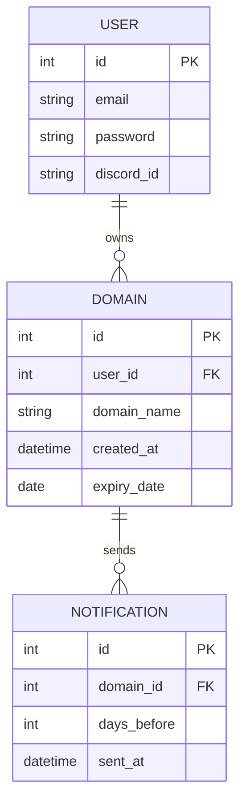

```mermaid
erDiagram
    USER ||--o{ DOMAIN : owns
    DOMAIN ||--o{ NOTIFICATION : sends

    USER {
        int id PK
        string email
        string password
        string discord_id
    }

    DOMAIN {
        int id PK
        int user_id FK
        string domain_name
        datetime created_at
        date expiry_date
    }

    NOTIFICATION {
        int id PK
        int domain_id FK
        int days_before
        datetime sent_at
    }

```