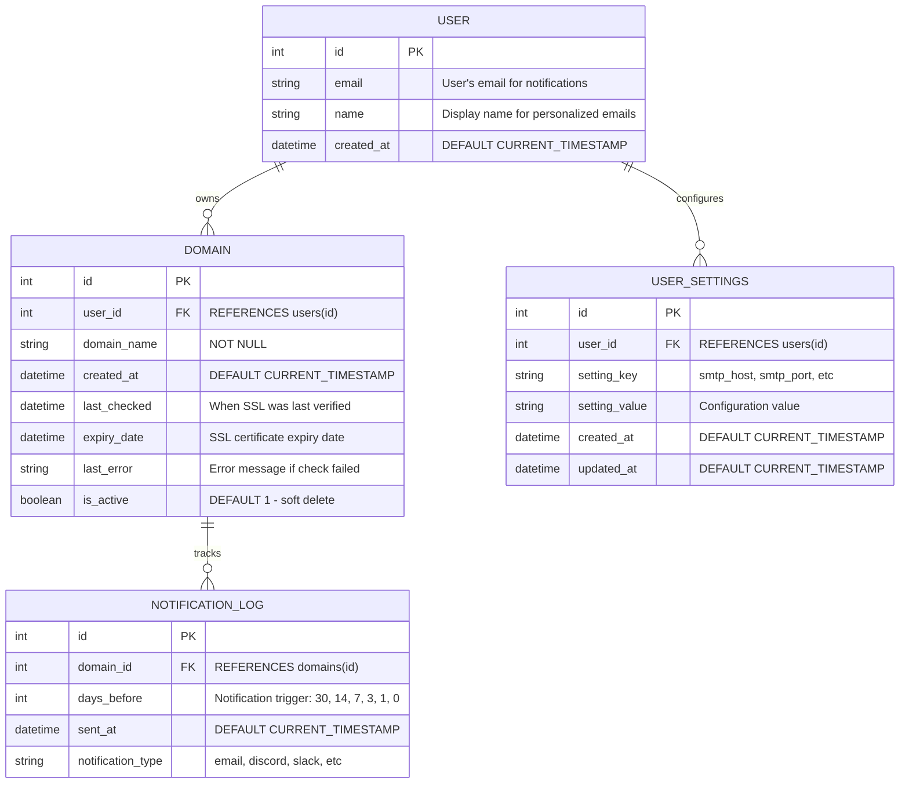

## Getting Started

```bash
git clone https://github.com/samokw/ssl_tracker.git
```
follow go installation instructions and make sure to install at least 1.24.3 : https://go.dev/dl/


## View documentation
Tool to view documentation in browser
```bash 
go install golang.org/x/tools/cmd/godoc@latest
```
Start the documentation server

```bash 
godoc -http=:8080
```

Then visit http://localhost:8080/pkg/github.com/samokw/ssl_tracker/internal/ssl/



